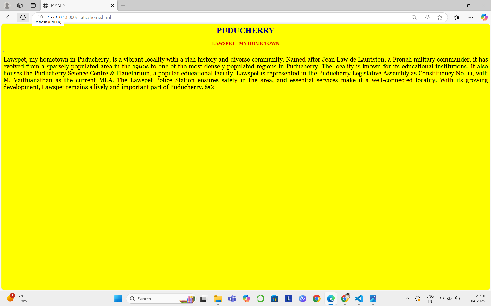
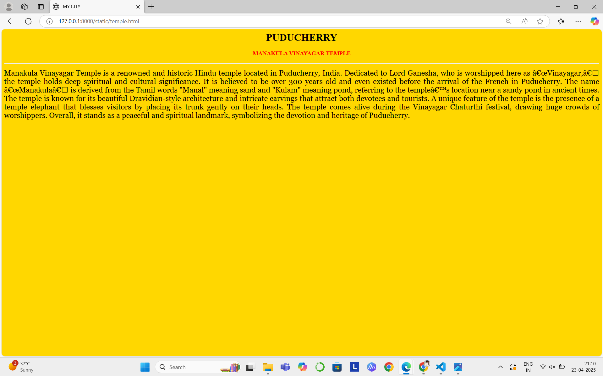
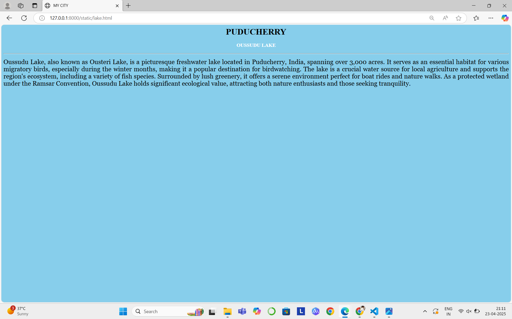
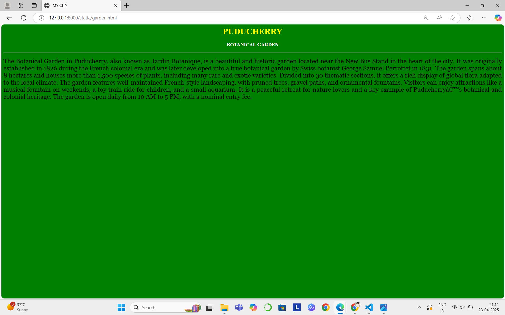
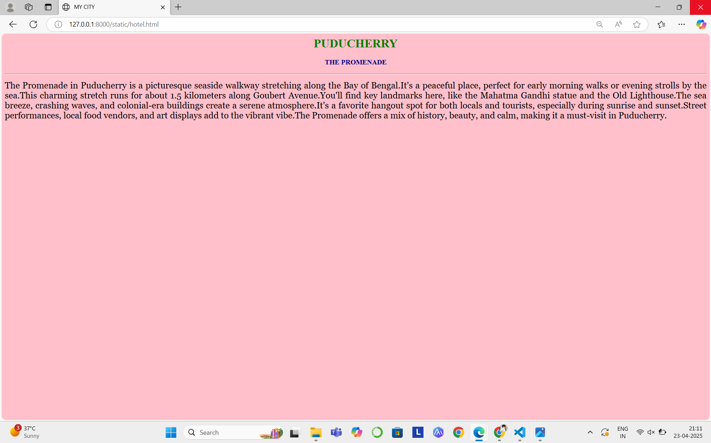

# Ex04 Places Around Me
## Date: 23.04.2025

## AIM
To develop a website to display details about the places around my house.

## DESIGN STEPS

### STEP 1
Create a Django admin interface.

### STEP 2
Download your city map from Google.

### STEP 3
Using ```<map>``` tag name the map.

### STEP 4
Create clickable regions in the image using ```<area>``` tag.

### STEP 5
Write HTML programs for all the regions identified.

### STEP 6
Execute the programs and publish them.

## CODE
```
map.html
<html>
    <body> 
        <h1 align="center">
        <font color="red"><i><u>PUDUCHERRY</u></i></font>
        </h1>  
        <h2 align="center">
        <font color="blue"><u>A NABITHRA (212224230172)</u></font>
        </h2> 
        <center>
        
        

        <map name="image-map">
            <area target="" alt="MY HOME TOWN" title="MY HOME TOWN" href="home.html" coords="1415,291,1268,180" shape="rect">
            <area target="" alt="MANAKULA VINAYAGAR TEMPLE" title="MANAKULA VINAYAGAR TEMPLE" href="temple.html" coords="1477,520,129" shape="circle">
            <area target="" alt="OUSSUDU LAKE" title="OUSSUDU LAKE" href="lake.html" coords="134,447,112" shape="circle">
            <area target="" alt="BOTANICAL GARDEN" title="BOTANICAL GARDEN" href="garden.html" coords="1360,684,104" shape="circle">
            <area target="" alt="THE PROMENADE" title="THE PROMENADE" href="hotel.html" coords="1632,613,85" shape="circle">
        </map>
        </center>
    </body>      
</html>

home.html
<html>
    <head>
        <title>MY CITY</title>
    </head>
    <body bgcolor="yellow">
    <h1 align="center">
     <font color="darkblue"><b>PUDUCHERRY</b></font>
    </h1>
    <h3 align="center">
    <font color="darkpink"><b>LAWSPET - MY HOME TOWN</b></font>
    </h3>
    <hr size="3", colour="red">
    <p align="justify">
    <font face="Georgia" size="5">
        Lawspet, my hometown in Puducherry, is a vibrant locality with a rich history and diverse community. Named after Jean Law de Lauriston, a French military commander, it has evolved from a sparsely populated area in the 1990s to one of the most densely populated regions in Puducherry. The locality is known for its educational institutions. It also houses the Puducherry Science Centre & Planetarium, a popular educational facility. Lawspet is represented in the Puducherry Legislative Assembly as Constituency No. 11, with M. Vaithianathan as the current MLA. The Lawspet Police Station ensures safety in the area, and essential services make it a well-connected locality. With its growing development, Lawspet remains a lively and important part of Puducherry.
    ​</font>
     </p>
    </body>
</html>

temple.html
<html>
    <head>
        <title>MY CITY</title>
    </head>
    <body bgcolor="gold">
    <h1 align="center">
     <font color="black"><b>PUDUCHERRY</b></font>
    </h1>
    <h3 align="center">
    <font color="red"><b>MANAKULA VINAYAGAR TEMPLE</b></font>
    </h3>
    <hr size="3", colour="red">
    <p align="justify">
    <font face="Georgia" size="5">
        Manakula Vinayagar Temple is a renowned and historic Hindu temple located in Puducherry, India. Dedicated to Lord Ganesha, who is worshipped here as “Vinayagar,” the temple holds deep spiritual and cultural significance. It is believed to be over 300 years old and even existed before the arrival of the French in Puducherry. The name “Manakula” is derived from the Tamil words "Manal" meaning sand and "Kulam" meaning pond, referring to the temple’s location near a sandy pond in ancient times. The temple is known for its beautiful Dravidian-style architecture and intricate carvings that attract both devotees and tourists. A unique feature of the temple is the presence of a temple elephant that blesses visitors by placing its trunk gently on their heads. The temple comes alive during the Vinayagar Chaturthi festival, drawing huge crowds of worshippers. Overall, it stands as a peaceful and spiritual landmark, symbolizing the devotion and heritage of Puducherry.
    </font>
     </p>
    </body>
</html>

lake.html
<html>
    <head>
        <title>MY CITY</title>
    </head>
    <body bgcolor="skyblue">
    <h1 align="center">
     <font color="black"><b>PUDUCHERRY</b></font>
    </h1>
    <h3 align="center">
    <font color="white"><b>OUSSUDU LAKE</b></font>
    </h3>
    <hr size="3", colour="red">
    <p align="justify">
    <font face="Georgia" size="5">
        Oussudu Lake, also known as Ousteri Lake, is a picturesque freshwater lake located in Puducherry, India, spanning over 3,000 acres. It serves as an essential habitat for various migratory birds, especially during the winter months, making it a popular destination for birdwatching. The lake is a crucial water source for local agriculture and supports the region's ecosystem, including a variety of fish species. Surrounded by lush greenery, it offers a serene environment perfect for boat rides and nature walks. As a protected wetland under the Ramsar Convention, Oussudu Lake holds significant ecological value, attracting both nature enthusiasts and those seeking tranquility.
    </font>
     </p>
    </body>
</html>

garden.html
<html>
    <head>
        <title>MY CITY</title>
    </head>
    <body bgcolor="green">
    <h1 align="center">
     <font color="yellow"><b>PUDUCHERRY</b></font>
    </h1>
    <h3 align="center">
    <font color="white"><b>BOTANICAL GARDEN</b></font>
    </h3>
    <hr size="3", colour="red">
    <p align="justify">
    <font face="Georgia" size="5">
        The Botanical Garden in Puducherry, also known as Jardin Botanique, is a beautiful and historic garden located near the New Bus Stand in the heart of the city. It was originally established in 1826 during the French colonial era and was later developed into a true botanical garden by Swiss botanist George Samuel Perrottet in 1831. The garden spans about 8 hectares and houses more than 1,500 species of plants, including many rare and exotic varieties. Divided into 30 thematic sections, it offers a rich display of global flora adapted to the local climate. The garden features well-maintained French-style landscaping, with pruned trees, gravel paths, and ornamental fountains. Visitors can enjoy attractions like a musical fountain on weekends, a toy train ride for children, and a small aquarium. It is a peaceful retreat for nature lovers and a key example of Puducherry’s botanical and colonial heritage. The garden is open daily from 10 AM to 5 PM, with a nominal entry fee.    
    </font>
     </p>
    </body>
</html>

hotel.html
<html>
    <head>
        <title>MY CITY</title>
    </head>
    <body bgcolor="pink">
    <h1 align="center">
     <font color="green"><b>PUDUCHERRY</b></font>
    </h1>
    <h3 align="center">
    <font color="darkblue"><b>THE PROMENADE</b></font>
    </h3>
    <hr size="3", colour="red">
    <p align="justify">
    <font face="Georgia" size="5">
        The Promenade in Puducherry is a picturesque seaside walkway stretching along the Bay of Bengal.It's a peaceful place, perfect for early morning walks or evening strolls by the sea.This charming stretch runs for about 1.5 kilometers along Goubert Avenue.You'll find key landmarks here, like the Mahatma Gandhi statue and the Old Lighthouse.The sea breeze, crashing waves, and colonial-era buildings create a serene atmosphere.It's a favorite hangout spot for both locals and tourists, especially during sunrise and sunset.Street performances, local food vendors, and art displays add to the vibrant vibe.The Promenade offers a mix of history, beauty, and calm, making it a must-visit in Puducherry.
    </font>
     </p>
    </body>
</html>

```


## OUTPUT







## RESULT
The program for implementing image maps using HTML is executed successfully.
